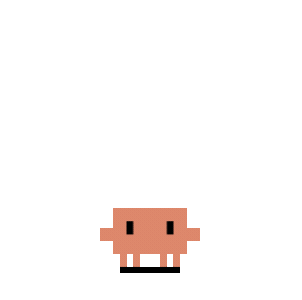
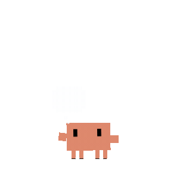
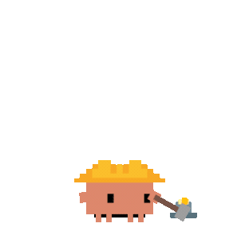

<p align="center">
  
</p>
<h1 align="center">Clawd on Desk</h1>
<p align="center">
  <a href="README.md">English</a>
  ·
  <a href="README.zh-CN.md">中文版</a>
  ·
  <a href="README.zh-TW.md">繁體中文</a>
  ·
  <a href="README.ko-KR.md">한국어</a>
  ·
  <a href="README.ja-JP.md">日本語</a>
</p>
<p align="center">
  <sub>🌏 ¿No encuentras tu idioma? <a href="https://github.com/rullerzhou-afk/clawd-on-desk/pulls">Abre un PR</a> para añadirlo. Français, Deutsch y cualquier otro idioma son bienvenidos.</sub>
</p>
<p align="center">
  <a href="https://github.com/rullerzhou-afk/clawd-on-desk/releases"></a>
  
</p>
<p align="center">
  <a href="https://github.com/rullerzhou-afk/clawd-on-desk/stargazers"></a>
  <a href="https://github.com/hesreallyhim/awesome-claude-code"></a>
</p>

<p align="center">
  
</p>

Clawd vive en tu escritorio y reacciona en tiempo real a lo que hace tu agente de programación con IA. Inicia una tarea larga, aléjate y vuelve cuando el cangrejo te avise de que terminó.

Piensa cuando envías un prompt, escribe cuando se ejecutan herramientas, se mueve o hace malabares con los subagentes, revisa permisos, celebra al terminar las tareas y duerme cuando te alejas. Incluye tres temas: **Clawd** (cangrejo pixelado), **Calico** (三花猫) y **Cloudling** (云宝), además de compatibilidad completa con temas personalizados y paquetes de animaciones Codex Pet importados.

> Compatible con Windows 11, macOS y Ubuntu/Linux. Las releases de Windows incluyen instaladores x64 y ARM64 separados. Las compilaciones desde el código fuente requieren Node.js. Funciona con **Claude Code**, **Codex CLI**, **Copilot CLI**, **Gemini CLI**, **Antigravity CLI (agy)**, **Cursor Agent**, **CodeBuddy**, **WorkBuddy**, **Kiro CLI**, **Kimi Code CLI (Kimi-CLI)**, **Qwen Code**, **ZCode**, **CodeWhale**, **opencode**, **MiMo Code**, **Pi**, **OpenClaw**, **Hermes Agent**, **Qoder**, **QoderWork**, **QwenWork (千问办公)**, **Reasonix CLI** y **DeepSeek Harness**.

## Funciones

### Compatibilidad con varios agentes
- **Claude Code** — integración completa mediante hooks de comandos y hooks HTTP de permisos
- **Codex CLI** — hooks oficiales con fallback JSONL (`~/.codex/sessions/`), sincronizados automáticamente de forma predeterminada y con globos de permisos reales
- **Copilot CLI** — hooks de comandos opcionales mediante `~/.copilot/hooks/hooks.json` (instálalos desde Ajustes → Agentes; consulta la guía de Copilot para el fallback JSON manual)
- **Gemini CLI** — hooks de comandos opcionales mediante `~/.gemini/settings.json` (instálalos desde Ajustes → Agentes o ejecuta `npm run install:gemini-hooks`)
- **Antigravity CLI (agy)** — hooks de comandos opcionales mediante `~/.gemini/config/hooks.json` (instálalos desde Ajustes → Agentes o ejecuta `npm run install:antigravity-hooks`); **solo estado**: Clawd nunca muestra un globo de permisos para agy. Todas las decisiones Permitir / Denegar / Permitir siempre se toman en el menú de la terminal de agy
- **Cursor Agent** — [hooks de Cursor IDE](https://cursor.com/docs/agent/hooks) opcionales en `~/.cursor/hooks.json` (instálalos desde Ajustes → Agentes o ejecuta `npm run install:cursor-hooks`)
- **CodeBuddy** — hooks de comandos compatibles con Claude Code y hooks HTTP de permisos opcionales mediante `~/.codebuddy/settings.json` (instálalos desde Ajustes → Agentes o ejecuta `node hooks/codebuddy-install.js`)
- **Agentes HTTP personalizados** — registra otro ejecutable local en Ajustes y envía por POST eventos de ciclo de vida al endpoint dinámico `/state` de Clawd. El registro no instala hooks ni hace que una aplicación cualquiera informe automáticamente; v1 es solo estado y deja las decisiones de permisos en la interfaz de la propia aplicación. Consulta la [guía de agentes HTTP personalizados](docs/guides/custom-agent-http.md).
- **WorkBuddy** — hooks de comandos compatibles con Claude Code opcionales mediante `~/.workbuddy-ai/settings.json` (actual) o `~/.workbuddy/settings.json` (antiguo; instálalos desde Ajustes → Agentes o ejecuta `node hooks/workbuddy-install.js`). Solo Estado + Notificación: la aplicación de escritorio resuelve los permisos en su propio sandbox y GUI nativos, por lo que Clawd no registra un hook de permisos.
- **Kiro CLI** — hooks de comandos opcionales inyectados en configuraciones de agentes personalizadas dentro de `~/.kiro/agents/`, además de un agente `clawd` creado automáticamente que se vuelve a sincronizar desde el `kiro_default` integrado de Kiro después de instalar la integración. Así puedes activar los hooks con una variación mínima de comportamiento mediante `kiro-cli --agent clawd` o `/agent swap clawd`. Los hooks de estado están verificados en macOS y Windows.
- **Kimi Code CLI (Kimi-CLI)** — hooks de comandos opcionales mediante `~/.kimi/config.toml` (entradas `[[hooks]]`; instálalos desde Ajustes → Agentes o ejecuta `npm run install:kimi-hooks`)
- **Qwen Code** — hooks de comandos opcionales mediante `~/.qwen/settings.json` (instálalos desde Ajustes → Agentes o ejecuta `npm run install:qwen-hooks`); admite seguimiento de estado y globos de aprobación de escritorio para `PermissionRequest` de Qwen
- **ZCode** — hooks opcionales de solo estado mediante `~/.zcode/cli/config.json` → `hooks.events.*` (instálalos desde Ajustes → Agentes o ejecuta `npm run install:zcode-hooks`); la fase 1 controla las animaciones de sesión, prompt, herramienta, error y finalización sin interceptar los permisos de ZCode. Clawd conserva los ajustes explícitos globales o por hook `enabled:false`
- **CodeWhale** — hooks opcionales de ciclo de vida y solo estado mediante `~/.codewhale/config.toml` (entradas `[[hooks.hooks]]`; instálalos desde Ajustes → Agentes o ejecuta `npm run install:codewhale-hooks`); la fase 1 solo controla las animaciones de inactividad, pensamiento, trabajo, sueño, error, atención y compactación, sin globos de permisos ni seguimiento de subagentes
- **Reasonix CLI** — hooks de comandos opcionales y de solo estado mediante `<Reasonix home>/settings.json` (`~/.reasonix/settings.json` en macOS/Linux y `%APPDATA%\reasonix\settings.json` en Windows; instálalos desde Ajustes → Agentes o ejecuta `npm run install:reasonix-hooks`); la fase 1 controla las animaciones de ciclo de vida, herramienta, notificación, compactación y detención de subagentes, mientras las decisiones de permisos permanecen en el flujo de terminal de Reasonix
- **opencode** — [integración mediante plugin](https://opencode.ai/docs/plugins) opcional a través de `~/.config/opencode/opencode.json` (instálala desde Ajustes → Agentes o ejecuta `node hooks/opencode-install.js`); transmisión de eventos sin latencia y globos de permisos con Permitir/Siempre/Denegar. Las sesiones hijas creadas por la herramienta `task` no tienen interfaz y no participan en las animaciones visibles de varias sesiones
- **MiMo Code** — [integración mediante plugin](https://opencode.ai/docs/plugins) opcional a través del archivo efectivo dentro de `~/.config/mimocode/` (`config.json` → `mimocode.json` → `mimocode.jsonc` predeterminado; gana el último; instálala desde Ajustes → Agentes o ejecuta `npm run install:mimocode-plugin`); comparte el SDK `@mimo-ai/plugin` y el comportamiento de permisos de opencode. Sus sesiones hijas de `task` tampoco tienen interfaz
- **Pi** — extensión global opcional en `~/.pi/agent/extensions/clawd-on-desk` (instálala desde Ajustes → Agentes o ejecuta `npm run install:pi-extension`); actualizaciones de ciclo de vida interactivo y actividad de herramientas de solo estado, conservando el comportamiento YOLO predeterminado de Pi
- **OpenClaw** — integración opcional mediante plugin y de solo estado a través de `~/.openclaw/openclaw.json` (instálala desde Ajustes → Agentes o ejecuta `npm run install:openclaw-plugin`; OpenClaw también necesita una configuración inicializada); las sesiones locales `openclaw tui --local` controlan las animaciones de Clawd, sin globos de permisos ni enfoque de terminal en la fase 1
- **Hermes Agent** — [integración mediante plugin](https://hermes-agent.org/) opcional en el directorio de plugins administrado por Hermes (instálala desde Ajustes → Agentes o ejecuta `npm run install:hermes-plugin`); admite estado, sesiones, SessionEnd, enfoque de terminal y los globos de permisos compatibles
- **Qoder** — hooks de comandos opcionales y de solo estado mediante `~/.qoder/settings.json` (instálalos desde Ajustes → Agentes o ejecuta `npm run install:qoder-hooks`); la fase 1 solo controla las animaciones de Clawd: las solicitudes de permisos de Qoder se observan como notificaciones y todas las decisiones Permitir / Denegar permanecen en el flujo propio de Qoder
- **QoderWork** — hooks de comandos opcionales y de solo estado mediante `~/.qoderwork/settings.json` (instálalos desde Ajustes → Agentes o ejecuta `npm run install:qoderwork-hooks`); la fase 1 controla las animaciones de Clawd y el HUD de sesiones. Los eventos de permisos de QoderWork se observan en silencio como parte del flujo de trabajo y todas las decisiones Permitir / Denegar permanecen en el flujo propio de QoderWork
- **QwenWork (千问办公)** — hooks de comandos opcionales, solo mediante hooks y de solo estado, a través de `~/.QwenWorkCN/settings.json` (instálalos desde Ajustes → Agentes o ejecuta `npm run install:qwenwork-hooks`; desinstálalos con `npm run uninstall:qwenwork-hooks`); solo para escritorio macOS y Windows. [qwenwork.cn/download](https://qwenwork.cn/download) no ofrece cliente Linux, por lo que no existe emparejamiento WSL. La fase 1 controla las animaciones de Clawd y el HUD de sesiones; `PermissionRequest` / `PermissionDenied` solo se observan y se asignan a `working`, stdout del hook siempre es `{}` y Clawd nunca produce Permitir / Denegar: el flujo de permisos nativo de QwenWork sigue siendo el único que decide. No hay recuperación al inicio: que el proceso de escritorio siga abierto no significa que haya un turno en curso
- **DeepSeek Harness** — integración experimental y exclusiva del perfil web mediante un plugin DSH administrado por Clawd dentro del proceso. Los eventos públicos de sesión controlan el estado de Clawd con orden por sesión, y las llamadas públicas bloqueantes `approval/request` pueden mostrar un globo Permitir una vez / Denegar; una ausencia de decisión siempre vuelve al respondedor web nativo de DSH. `ask_user_question` permanece completamente nativo de DSH y Clawd nunca lee el almacenamiento de proyección de DSH. Consulta la [guía de DeepSeek Harness](docs/guides/dsh-setup.md)
- **Convivencia de varios agentes** — ejecuta todos los agentes al mismo tiempo; Clawd sigue cada sesión de forma independiente

### Animaciones e interacción
- **Estado en tiempo real** — los hooks de los agentes y el sondeo de logs controlan automáticamente las animaciones de Clawd
- **12 estados animados** — inactivo, pensando, escribiendo, construyendo, movimiento de subagente, malabares con varios subagentes, error, feliz, notificación, compactación, transporte y sueño
- **Importación de Codex Pet** — importa paquetes zip de Codex Pet desde `Ajustes…` → `Tema`; Clawd adapta las animaciones de su atlas a temas administrados
- **Seguimiento ocular** — Clawd sigue el cursor mientras está inactivo, inclinando el cuerpo y estirando la sombra
- **Secuencia de sueño** — bosteza, cabecea, se desploma y se duerme tras 60 segundos de inactividad; mover el mouse activa una animación de despertar sobresaltado
- **Reacciones a clics** — doble clic para darle un toque y 4 clics para que se agite
- **Arrastre desde cualquier estado** — agarra a Clawd cuando quieras (Pointer Capture evita que se suelte al moverlo rápido) y suéltalo para continuar
- **Modo mini** — arrástralo al borde derecho o haz clic derecho en «Modo mini»; Clawd se esconde en el borde, asoma al pasar el cursor, muestra alertas y celebraciones mini y usa transiciones de salto parabólicas

### Globo de permisos
- **Revisión de permisos en la aplicación** — cuando una integración con permisos envía una solicitud compatible, Clawd puede mostrar una tarjeta flotante en lugar de esperar en la terminal; los agentes de solo estado conservan su flujo de permisos nativo
- **Permitir / denegar / acciones propias del agente** — aprueba o rechaza con un clic, además de usar reglas de permisos o acciones `Always` cuando el agente de origen las admite
- **Modos de gestión de permisos** — elige **Preguntar siempre**, **Solo preguntas** con confirmación (solicitudes con forma de herramienta de agentes explícitamente compatibles) o **Aprobar automáticamente**. La aprobación automática gestiona cualquier solicitud que el adaptador marque como apta para automatización —incluidos nombres de solicitudes no vacíos y no reconocidos de Claude/Qwen—, pero los nombres ausentes, las formas de decisión no compatibles y las preguntas o planes de CodeBuddy vuelven al flujo nativo. El modo se rebaja tras reiniciar, y cada sesión activa apta puede elegir de forma independiente Preguntar siempre o solo herramientas. Consulta la [guía de configuración](docs/guides/setup-guide.md#permission-handling-automation)
- **Aprobación remota opcional** — Telegram y Feishu/Lark pueden reflejar solicitudes pendientes aptas mientras el globo local sigue disponible. Un fallo del canal no produce ninguna decisión remota ni una denegación: la solicitud de escritorio permanece pendiente, y las solicitudes solo remotas vuelven al agente únicamente después de que todos los clientes disponibles regresen sin decisión
- **Atajos globales** — `Ctrl+Shift+Y` permite y `Ctrl+Shift+N` deniega el globo de permisos más reciente (solo se registran mientras hay globos visibles)
- **Diseño apilado** — varias solicitudes de permisos se apilan hacia arriba desde la esquina inferior derecha
- **Cierre automático** — si respondes primero en la terminal, el globo desaparece automáticamente
- **Interruptor por agente** — abre `Ajustes…` → `Agentes`, elige un agente y desactiva `Mostrar globos emergentes` para conservar las solicitudes en la terminal/TUI del propio agente

### Información de sesiones
- **Seguimiento de varias sesiones** — las sesiones de todos los agentes se resuelven al estado de mayor prioridad
- **Detección de subagentes** — movimiento con auriculares para 1 subagente y malabares con tres pelotas para 2 o más
- **Panel de sesiones + HUD** — haz clic derecho o usa la bandeja → `Abrir panel` para revisar sesiones activas, eventos recientes y alias, y saltar a una terminal; un HUD compacto junto a Clawd mantiene visibles las sesiones activas
- **Cuota de suscripción de un vistazo** — los anillos Orbit opcionales junto a la mascota y las barras detalladas del panel muestran las ventanas de cuota informadas por los agentes compatibles. La recopilación local de Claude está desactivada de forma predeterminada y usa el [payload oficial `rate_limits` de la statusline](https://code.claude.com/docs/en/statusline) de Claude Code; no realiza ninguna solicitud adicional a Anthropic. Consulta las [notas sobre flujo de datos y propiedad](docs/guides/setup-guide.md#claude-code-subscription-quota-official-status-line-not-scraping).
- **Enfoque de terminal** — las acciones del panel/HUD saltan a la ventana de terminal de una sesión concreta; los estados de notificación o atención enfocan automáticamente la terminal correspondiente
- **Detección de procesos activos** — detecta los procesos compatibles que terminaron o fallaron y limpia las sesiones huérfanas
- **Recuperación al inicio** — si Clawd se reinicia mientras sigue ejecutándose algún agente compatible, permanece despierto en lugar de dormirse

### Aplicación móvil complementaria (PWA)
- **Espejo en vivo en tu teléfono** — activa `Ajustes…` → `Móvil / PWA` y abre en el teléfono la URL de emparejamiento; la aplicación web Clawd Mobile muestra en tiempo real las sesiones de tus agentes y sus estados
- **Solo lectura por diseño** — el puente LAN solo transmite el estado; nada de la PWA puede modificar tu equipo (la aprobación desde la PWA LAN está en la hoja de ruta; Telegram y Feishu/Lark son canales compatibles independientes)
- **Solo LAN y protegido por token** — el emparejamiento requiere un token, los tokens rotan automáticamente con un periodo de gracia y el acceso puede regenerarse o restablecerse con un clic
- **Instalable** — es una PWA: añádela a la pantalla de inicio para usarla como una aplicación
> La línea de la aplicación móvil complementaria —desde el primer prototipo hasta la rotación de tokens— está construida y liderada por el colaborador principal [@Bynlk](https://github.com/Bynlk), que también mantiene [clawd-on-mobile](https://github.com/Bynlk/clawd-on-mobile), un fork hermano con una aplicación Android nativa.

### Sistema
- **Clic transparente** — las áreas transparentes pasan los clics a las ventanas inferiores; solo el cuerpo de Clawd es interactivo
- **Memoria de posición** — Clawd recuerda dónde lo dejaste después de reiniciar (incluido el modo mini)
- **Bloqueo de instancia única** — evita ventanas duplicadas de Clawd
- **Inicio automático** — el hook SessionStart de Claude Code puede iniciar Clawd automáticamente si no está en ejecución
- **No molestar** — haz clic derecho o usa la bandeja para entrar en modo de sueño; todos los eventos de hooks quedan silenciados hasta que despiertes a Clawd. Los globos de permisos se suprimen durante No molestar: Codex, opencode y MiMo Code vuelven a sus solicitudes nativas, mientras Claude Code y CodeBuddy vuelven a su flujo de permisos integrado. WorkBuddy usa solo Estado + Notificación; Antigravity y Pi son integraciones de solo estado.
- **Efectos de sonido** — avisos de audio breves al terminar tareas y recibir solicitudes de permisos (se activan desde la bandeja o Ajustes; espera de 10 s y silencio automático durante No molestar)
- **Bandeja del sistema** — modo No molestar, inicio automático y búsqueda de actualizaciones
- **i18n** — interfaz en inglés, chino simplificado, chino tradicional, coreano, japonés, portugués de Brasil y español; cambia el idioma en Ajustes → General
- **Actualización automática** — busca releases de GitHub; Windows instala actualizaciones NSIS al salir y macOS/Linux ejecutan `git pull` + reinicio cuando se usa un repositorio clonado

## Animaciones

<table>
  <tr>
    <td align="center"><br><sub>Inactivo</sub></td>
    <td align="center"><br><sub>Burbuja de pensamiento</sub></td>
    <td align="center"><br><sub>Escribiendo</sub></td>
    <td align="center"><br><sub>Construyendo</sub></td>
    <td align="center"><br><sub>1 subagente</sub></td>
    <td align="center"><br><sub>2+ subagentes</sub></td>
  </tr>
  <tr>
    <td align="center"><br><sub>Calico inactivo</sub></td>
    <td align="center"><br><sub>Calico pensando</sub></td>
    <td align="center"><br><sub>Calico escribiendo</sub></td>
    <td align="center"><br><sub>Calico construyendo</sub></td>
    <td align="center"><br><sub>Calico haciendo malabares</sub></td>
    <td align="center"><br><sub>Calico dirigiendo</sub></td>
  </tr>
  <tr>
    <td align="center"><br><sub>Cloudling inactivo</sub></td>
    <td align="center"><br><sub>Cloudling pensando</sub></td>
    <td align="center"><br><sub>Cloudling escribiendo</sub></td>
    <td align="center"><br><sub>Cloudling construyendo</sub></td>
    <td align="center"><br><sub>Cloudling haciendo malabares</sub></td>
    <td align="center"><br><sub>Cloudling dirigiendo</sub></td>
  </tr>
</table>

Asignación completa de eventos a estados, modo mini y reacciones a clics: **[docs/guides/state-mapping.md](docs/guides/state-mapping.md)**

## Varias pantallas

Clawd se adapta a configuraciones con varios monitores: el tamaño proporcional usa la pantalla donde se inicia Clawd, los monitores verticales reciben un aumento limitado para que la mascota siga viéndose bien en pantallas altas y estrechas, y puedes arrastrar a Clawd entre pantallas.

<p align="center"><sub>¿Quieres ver el comportamiento real con varios monitores? <a href="assets/videos/clawd-multi-monitor-demo.mp4">Mira el video de demostración de este repositorio</a>.</sub></p>

## Inicio rápido

Para un uso normal, descarga el instalador precompilado más reciente desde **[GitHub Releases](https://github.com/rullerzhou-afk/clawd-on-desk/releases/latest)**:

- **Windows**: `Clawd-on-Desk-Setup-<version>-x64.exe` o `Clawd-on-Desk-Setup-<version>-arm64.exe`
- **macOS**: `.dmg`
- **Linux**: `.AppImage` o `.deb`

Inicia Clawd después de instalarlo. Las instalaciones nuevas solo sincronizan automáticamente Claude Code y Codex; instala las demás integraciones locales desde **Ajustes → Agentes** cuando las necesites.

Ejecuta desde el código fuente únicamente si vas a contribuir, probar código aún no publicado o depurar integraciones. Las instalaciones desde el código fuente descargan Electron y herramientas de compilación, y pueden crear un árbol `node_modules` grande.

```bash
# Clona el repositorio
git clone https://github.com/rullerzhou-afk/clawd-on-desk.git
cd clawd-on-desk

# Instala las dependencias
npm install

# Inicia Clawd (registra automáticamente los hooks de Claude Code y Codex)
npm start
```

**Claude Code** y **Codex CLI** funcionan directamente con hooks registrados automáticamente. Para **Copilot CLI**, **Gemini CLI**, **Antigravity CLI (agy)**, **Cursor Agent**, **CodeBuddy**, **WorkBuddy**, **Kiro CLI**, **Kimi Code CLI (Kimi-CLI)**, **Qwen Code**, **ZCode**, **CodeWhale**, **opencode**, **MiMo Code**, **Pi**, **OpenClaw**, **Hermes Agent**, **Qoder**, **QoderWork**, **QwenWork (千问办公)**, **Reasonix CLI** y **DeepSeek Harness**, instala primero la integración desde **Ajustes → Agentes**; Clawd la mantendrá sincronizada mientras siga activada. También incluye SSH remoto, WSL y notas específicas de cada plataforma (macOS / Linux): **[docs/guides/setup-guide.md](docs/guides/setup-guide.md)**

¿Quieres ejecutar Claude Code / Codex CLI en un servidor remoto y mostrar el estado y los globos de permisos en tu Clawd local? Usa **Ajustes → Hosts SSH → Desplegar / Reparar hooks** dentro de la aplicación. Guía completa, límite de aislamiento en servidores compartidos, alcance de Doctor y preguntas frecuentes: **[docs/guides/guide-remote-ssh.md](docs/guides/guide-remote-ssh.md)**

Para consultar el estado oficial de `Codex + WSL`, el alcance actual de Clawd y por qué es fácil interpretarlo mal, consulta: **[docs/guides/codex-wsl-clarification.md](docs/guides/codex-wsl-clarification.md)**

## Limitaciones conocidas

Algunos agentes tienen funciones incompletas (sin globo de permisos, latencia de sondeo o sin enfoque de terminal). Consulta la tabla completa: **[docs/guides/known-limitations.md](docs/guides/known-limitations.md)**

## Temas personalizados

Clawd admite temas personalizados: sustituye el cangrejo predeterminado por tu propio personaje y animaciones. Si ya tienes un paquete Codex Pet, importa su zip desde `Ajustes…` → `Tema` → `Importar zip de mascota`; Clawd convierte automáticamente el atlas en un tema administrado.

**Inicio rápido:**
1. Crea la estructura de un tema:
   ```bash
   node scripts/create-theme.js my-theme
   # o
   npm run create-theme -- my-theme
   ```
   También funciona sin argumentos: crea la siguiente estructura `my-theme` disponible en tu directorio de temas de usuario.
2. Edita `theme.json` y crea tus recursos (SVG, GIF, APNG, WebP, PNG, JPG o JPEG)
3. Reinicia Clawd o abre `Ajustes…` → `Tema` → selecciona tu tema

**Tema mínimo viable:** 1 SVG (inactividad con seguimiento ocular) + 7 archivos GIF/APNG (pensando, trabajando, error, feliz, notificación, durmiendo y despertando). Puedes desactivar el seguimiento ocular para usar cualquier formato en todos los estados.

Valida tu tema antes de distribuirlo:
```bash
node scripts/validate-theme.js path/to/your-theme
```

Las tarjetas de temas en `Ajustes…` → `Tema` muestran insignias de capacidades como `Inactividad con seguimiento`, `Tema estático`, `Mini`, `Sueño directo` y `Sin reacciones`, para que los usuarios sepan qué admite cada tema antes de cambiar.

Consulta [docs/guides/guide-theme-creation.md](docs/guides/guide-theme-creation.md) para ver la guía completa de creación con rutas por niveles (principiante → avanzado), referencia de campos de `theme.json` y pautas para los recursos.

> Los archivos SVG de terceros se sanitizan automáticamente por seguridad.

### Hoja de ruta

Algunas ideas que nos gustaría explorar en el futuro:

- Enfoque de la terminal de Codex mediante búsqueda en el árbol de procesos a partir del PID de `codex.exe`
- Registro de temas y descarga dentro de la aplicación
- Script de desinstalación de hooks para eliminar la aplicación limpiamente
- Aplicación móvil PWA por LAN: aprobación de permisos desde el navegador (en desarrollo, liderada por [@Bynlk](https://github.com/Bynlk)); Telegram y Feishu/Lark son canales de aprobación compatibles independientes

## Contribuir

Clawd on Desk es un proyecto impulsado por la comunidad. Los informes de errores, las ideas de funciones y los pull requests son bienvenidos: abre un [issue](https://github.com/rullerzhou-afk/clawd-on-desk/issues) para conversar o envía directamente un PR.

### Responsables del mantenimiento

<table>
  <tr>
    <td align="center" valign="top" width="140"><a href="https://github.com/rullerzhou-afk"><br /><sub><b>@rullerzhou-afk</b><br />鹿鹿 · creadora</sub></a></td>
    <td align="center" valign="top" width="140"><a href="https://github.com/YOIMIYA66"><br /><sub><b>@YOIMIYA66</b><br />responsable del mantenimiento</sub></a></td>
    <td align="center" valign="top" width="140"><a href="https://github.com/Bynlk"><br /><sub><b>@Bynlk</b><br />colaborador principal · Móvil / PWA</sub></a></td>
  </tr>
</table>

### Colaboradores

Gracias a todas las personas que han ayudado a mejorar Clawd:

<table>
  <tr>
    <td align="center" valign="top" width="110"><a href="https://github.com/PixelCookie-zyf"><br /><sub>PixelCookie-zyf</sub></a></td>
    <td align="center" valign="top" width="110"><a href="https://github.com/yujiachen-y"><br /><sub>yujiachen-y</sub></a></td>
    <td align="center" valign="top" width="110"><a href="https://github.com/AooooooZzzz"><br /><sub>AooooooZzzz</sub></a></td>
    <td align="center" valign="top" width="110"><a href="https://github.com/purefkh"><br /><sub>purefkh</sub></a></td>
    <td align="center" valign="top" width="110"><a href="https://github.com/Tobeabellwether"><br /><sub>Tobeabellwether</sub></a></td>
    <td align="center" valign="top" width="110"><a href="https://github.com/Jasonhonghh"><br /><sub>Jasonhonghh</sub></a></td>
    <td align="center" valign="top" width="110"><a href="https://github.com/crashchen"><br /><sub>crashchen</sub></a></td>
  </tr>
  <tr>
    <td align="center" valign="top" width="110"><a href="https://github.com/hongbigtou"><br /><sub>hongbigtou</sub></a></td>
    <td align="center" valign="top" width="110"><a href="https://github.com/InTimmyDate"><br /><sub>InTimmyDate</sub></a></td>
    <td align="center" valign="top" width="110"><a href="https://github.com/NeizhiTouhu"><br /><sub>NeizhiTouhu</sub></a></td>
    <td align="center" valign="top" width="110"><a href="https://github.com/xu3stones-cmd"><br /><sub>xu3stones-cmd</sub></a></td>
    <td align="center" valign="top" width="110"><a href="https://github.com/androidZzT"><br /><sub>androidZzT</sub></a></td>
    <td align="center" valign="top" width="110"><a href="https://github.com/Ye-0413"><br /><sub>Ye-0413</sub></a></td>
    <td align="center" valign="top" width="110"><a href="https://github.com/WanfengzzZ"><br /><sub>WanfengzzZ</sub></a></td>
  </tr>
  <tr>
    <td align="center" valign="top" width="110"><a href="https://github.com/TaoXieSZ"><br /><sub>TaoXieSZ</sub></a></td>
    <td align="center" valign="top" width="110"><a href="https://github.com/ssly"><br /><sub>ssly</sub></a></td>
    <td align="center" valign="top" width="110"><a href="https://github.com/stickycandy"><br /><sub>stickycandy</sub></a></td>
    <td align="center" valign="top" width="110"><a href="https://github.com/Rladmsrl"><br /><sub>Rladmsrl</sub></a></td>
    <td align="center" valign="top" width="110"><a href="https://github.com/YOIMIYA66"><br /><sub>YOIMIYA66</sub></a></td>
    <td align="center" valign="top" width="110"><a href="https://github.com/Kevin7Qi"><br /><sub>Kevin7Qi</sub></a></td>
    <td align="center" valign="top" width="110"><a href="https://github.com/sefuzhou770801-hub"><br /><sub>sefuzhou770801-hub</sub></a></td>
  </tr>
  <tr>
    <td align="center" valign="top" width="110"><a href="https://github.com/Tonic-Jin"><br /><sub>Tonic-Jin</sub></a></td>
    <td align="center" valign="top" width="110"><a href="https://github.com/seoki180"><br /><sub>seoki180</sub></a></td>
    <td align="center" valign="top" width="110"><a href="https://github.com/sophie-haynes"><br /><sub>sophie-haynes</sub></a></td>
    <td align="center" valign="top" width="110"><a href="https://github.com/PeterShanxin"><br /><sub>PeterShanxin</sub></a></td>
    <td align="center" valign="top" width="110"><a href="https://github.com/CHIANGANGSTER"><br /><sub>CHIANGANGSTER</sub></a></td>
    <td align="center" valign="top" width="110"><a href="https://github.com/JaeHyeon-KAIST"><br /><sub>JaeHyeon-KAIST</sub></a></td>
    <td align="center" valign="top" width="110"><a href="https://github.com/hhhzxyhhh"><br /><sub>hhhzxyhhh</sub></a></td>
  </tr>
  <tr>
    <td align="center" valign="top" width="110"><a href="https://github.com/TVpoet"><br /><sub>TVpoet</sub></a></td>
    <td align="center" valign="top" width="110"><a href="https://github.com/zeus6768"><br /><sub>zeus6768</sub></a></td>
    <td align="center" valign="top" width="110"><a href="https://github.com/anhtrinh919"><br /><sub>anhtrinh919</sub></a></td>
    <td align="center" valign="top" width="110"><sub>tomaioo</sub></td>
    <td align="center" valign="top" width="110"><a href="https://github.com/v-avuso"><br /><sub>v-avuso</sub></a></td>
    <td align="center" valign="top" width="110"><a href="https://github.com/livlign"><br /><sub>livlign</sub></a></td>
    <td align="center" valign="top" width="110"><a href="https://github.com/tongguang2"><br /><sub>tongguang2</sub></a></td>
  </tr>
  <tr>
    <td align="center" valign="top" width="110"><a href="https://github.com/Ziy1-Tan"><br /><sub>Ziy1-Tan</sub></a></td>
    <td align="center" valign="top" width="110"><a href="https://github.com/tatsuyanakanogaroinc"><br /><sub>tatsuyanakanogaroinc</sub></a></td>
    <td align="center" valign="top" width="110"><a href="https://github.com/yeonhub"><br /><sub>yeonhub</sub></a></td>
    <td align="center" valign="top" width="110"><a href="https://github.com/joshua-wu"><br /><sub>joshua-wu</sub></a></td>
    <td align="center" valign="top" width="110"><a href="https://github.com/nmsn"><br /><sub>nmsn</sub></a></td>
    <td align="center" valign="top" width="110"><a href="https://github.com/sunnysonx"><br /><sub>sunnysonx</sub></a></td>
    <td align="center" valign="top" width="110"><a href="https://github.com/YuChenYunn"><br /><sub>YuChenYunn</sub></a></td>
  </tr>
  <tr>
    <td align="center" valign="top" width="110"><a href="https://github.com/jhseo-b"><br /><sub>jhseo-b</sub></a></td>
    <td align="center" valign="top" width="110"><a href="https://github.com/Hwasowl"><br /><sub>Hwasowl</sub></a></td>
    <td align="center" valign="top" width="110"><a href="https://github.com/XiangZheng2002"><br /><sub>XiangZheng2002</sub></a></td>
    <td align="center" valign="top" width="110"><a href="https://github.com/keiyo118"><br /><sub>keiyo118</sub></a></td>
    <td align="center" valign="top" width="110"><a href="https://github.com/pan93412"><br /><sub>pan93412</sub></a></td>
    <td align="center" valign="top" width="110"><a href="https://github.com/taehwanis"><br /><sub>taehwanis</sub></a></td>
    <td align="center" valign="top" width="110"><a href="https://github.com/linnin233"><br /><sub>linnin233</sub></a></td>
  </tr>
  <tr>
    <td align="center" valign="top" width="110"><a href="https://github.com/xiyouMc"><br /><sub>xiyouMc</sub></a></td>
    <td align="center" valign="top" width="110"><a href="https://github.com/Bynlk"><br /><sub>Bynlk</sub></a></td>
    <td align="center" valign="top" width="110"><a href="https://github.com/zxypro1"><br /><sub>zxypro1</sub></a></td>
    <td align="center" valign="top" width="110"><a href="https://github.com/NeroAyase"><br /><sub>NeroAyase</sub></a></td>
    <td align="center" valign="top" width="110"><a href="https://github.com/divergentD"><br /><sub>divergentD</sub></a></td>
    <td align="center" valign="top" width="110"><a href="https://github.com/Ne9roni"><br /><sub>Ne9roni</sub></a></td>
    <td align="center" valign="top" width="110"><a href="https://github.com/QingXB"><br /><sub>QingXB</sub></a></td>
  </tr>
  <tr>
    <td align="center" valign="top" width="110"><a href="https://github.com/29206394"><br /><sub>藤知</sub></a></td>
    <td align="center" valign="top" width="110"><a href="https://github.com/Tsdsj"><br /><sub>Tsdsj</sub></a></td>
    <td align="center" valign="top" width="110"><a href="https://github.com/godlockin"><br /><sub>godlockin</sub></a></td>
    <td align="center" valign="top" width="110"><a href="https://github.com/sLingli"><br /><sub>sLingli</sub></a></td>
    <td align="center" valign="top" width="110"><a href="https://github.com/ustin-star"><br /><sub>ustin-star</sub></a></td>
    <td align="center" valign="top" width="110"><a href="https://github.com/cod3hulk"><br /><sub>cod3hulk</sub></a></td>
    <td align="center" valign="top" width="110"><a href="https://github.com/lxgxhsy"><br /><sub>lxgxhsy</sub></a></td>
  </tr>
  <tr>
    <td align="center" valign="top" width="110"><a href="https://github.com/rebootcrab-blip"><br /><sub>rebootcrab-blip</sub></a></td>
    <td align="center" valign="top" width="110"><a href="https://github.com/zhaoxv210"><br /><sub>zhaoxv210</sub></a></td>
    <td align="center" valign="top" width="110"><a href="https://github.com/serenNan"><br /><sub>serenNan</sub></a></td>
    <td align="center" valign="top" width="110"><a href="https://github.com/IatomicreactorI"><br /><sub>IatomicreactorI</sub></a></td>
    <td align="center" valign="top" width="110"><a href="https://github.com/quantai1314"><br /><sub>quantai1314</sub></a></td>
    <td align="center" valign="top" width="110"><a href="https://github.com/Git-creat7"><br /><sub>Git-creat7</sub></a></td>
    <td align="center" valign="top" width="110"><a href="https://github.com/undownding"><br /><sub>undownding</sub></a></td>
  </tr>
  <tr>
    <td align="center" valign="top" width="110"><a href="https://github.com/chrono-meta"><br /><sub>chrono-meta</sub></a></td>
    <td align="center" valign="top" width="110"><a href="https://github.com/Yike-Ye"><br /><sub>Yike-Ye</sub></a></td>
    <td align="center" valign="top" width="110"><a href="https://github.com/xiaoshidefeng"><br /><sub>xiaoshidefeng</sub></a></td>
    <td align="center" valign="top" width="110"><a href="https://github.com/yanguibao1997"><br /><sub>yanguibao1997</sub></a></td>
    <td align="center" valign="top" width="110"><a href="https://github.com/JasonZH6600"><br /><sub>JasonZH6600</sub></a></td>
    <td align="center" valign="top" width="110"><a href="https://github.com/V1staz"><br /><sub>V1staz</sub></a></td>
    <td align="center" valign="top" width="110"><a href="https://github.com/royhuang91"><br /><sub>royhuang91</sub></a></td>
  </tr>
  <tr>
    <td align="center" valign="top" width="110"><a href="https://github.com/Schlaflied"><br /><sub>Schlaflied</sub></a></td>
    <td align="center" valign="top" width="110"><a href="https://github.com/KaiC5504"><br /><sub>KaiC5504</sub></a></td>
    <td align="center" valign="top" width="110"><a href="https://github.com/jiaxuan1101"><br /><sub>jiaxuan1101</sub></a></td>
    <td align="center" valign="top" width="110"><a href="https://github.com/kkirito16"><br /><sub>kkirito16</sub></a></td>
    <td align="center" valign="top" width="110"><a href="https://github.com/200780381"><br /><sub>200780381</sub></a></td>
    <td align="center" valign="top" width="110"><a href="https://github.com/Dxy2326"><br /><sub>Dxy2326</sub></a></td>
    <td align="center" valign="top" width="110"><a href="https://github.com/lurui1997"><br /><sub>lurui1997</sub></a></td>
  </tr>
  <tr>
    <td align="center" valign="top" width="110"><a href="https://github.com/JesmonX"><br /><sub>JesmonX</sub></a></td>
    <td align="center" valign="top" width="110"><a href="https://github.com/chen86860"><br /><sub>chen86860</sub></a></td>
    <td align="center" valign="top" width="110"><a href="https://github.com/LinYsssss"><br /><sub>LinYsssss</sub></a></td>
    <td align="center" valign="top" width="110"><a href="https://github.com/He-wei-gui"><br /><sub>He-wei-gui</sub></a></td>
    <td align="center" valign="top" width="110"><a href="https://github.com/liugou27"><br /><sub>liugou27</sub></a></td>
    <td align="center" valign="top" width="110"><a href="https://github.com/YOOGOMJA"><br /><sub>YOOGOMJA</sub></a></td>
    <td align="center" valign="top" width="110"><a href="https://github.com/anupamme"><br /><sub>anupamme</sub></a></td>
  </tr>
  <tr>
    <td align="center" valign="top" width="110"><a href="https://github.com/anthonyonazure"><br /><sub>anthonyonazure</sub></a></td>
    <td align="center" valign="top" width="110"><a href="https://github.com/weed33834"><br /><sub>weed33834</sub></a></td>
    <td align="center" valign="top" width="110"><a href="https://github.com/arismarioneves"><br /><sub>arismarioneves</sub></a></td>
    <td align="center" valign="top" width="110"><a href="https://github.com/aaronWool"><br /><sub>aaronWool</sub></a></td>
    <td align="center" valign="top" width="110"><a href="https://github.com/Zamaniego"><br /><sub>Zamaniego</sub></a></td>
  </tr>
</table>

## Agradecimientos

- Referencia del pixel art de Clawd tomada de [clawd-tank](https://github.com/marciogranzotto/clawd-tank), de [@marciogranzotto](https://github.com/marciogranzotto)
- Compartido en la comunidad [LINUX DO](https://linux.do/)

## Licencia

El código fuente se distribuye bajo la [GNU Affero General Public License v3.0](LICENSE) (AGPL-3.0).

**Las ilustraciones y los recursos de temas incluidos (entre ellos `assets/` y `themes/*/assets/`) NO están cubiertos por AGPL-3.0.** Sus respectivos titulares conservan todos los derechos. Consulta [assets/LICENSE](assets/LICENSE) y los avisos siguientes para obtener más información.

- El personaje **Clawd** es propiedad de [Anthropic](https://www.anthropic.com). Este es un proyecto no oficial creado por fans, sin afiliación ni respaldo de Anthropic.
- Ilustración del **gato Calico (三花猫)** por 鹿鹿 ([@rullerzhou-afk](https://github.com/rullerzhou-afk)). Todos los derechos reservados.
- Ilustración de **Cloudling (云宝)** por 鹿鹿 ([@rullerzhou-afk](https://github.com/rullerzhou-afk)). Todos los derechos reservados. La dirección visual de Cloudling incluye un homenaje al logotipo de OpenAI Codex; las marcas Codex/OpenAI siguen siendo propiedad de OpenAI y este proyecto no está afiliado ni respaldado por OpenAI.
- **Contribuciones de terceros**: los respectivos artistas conservan los derechos de autor.

**Sin criptomonedas.** Este proyecto no tiene token, moneda, NFT ni airdrop, y no está afiliado a ningún proyecto de criptomonedas.
